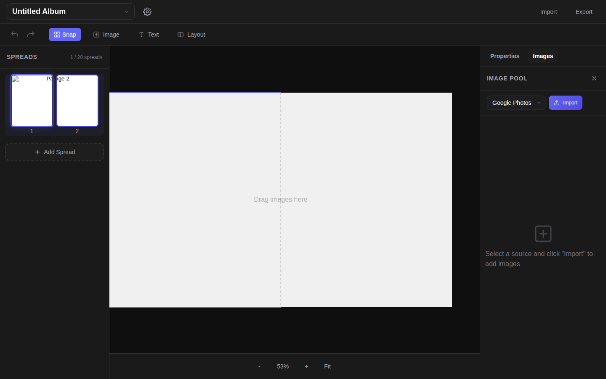

# Photo Album Editor

[](https://app.netlify.com/projects/photobookmaker/deploys)
[](https://github.com/yiochen/album_maker/actions/workflows/ci.yml)

A web-based photo album editor with a Google Slides-like interface. Create beautiful photo albums with drag-and-drop, customizable templates, and multi-source photo import.

## Interface



## Features

- 📸 **Multi-source Import** - Google Photos, dummy test images, or add your own
- 📁 **Multi-album Support** - Create, switch, and manage multiple albums
- 🎨 **7 Page Templates** - Full page, square, portrait, landscape, polaroid, grids
- 🖱️ **Drag & Drop** - Place and resize images on the canvas
- 💾 **Auto-save** - Albums persist in IndexedDB
- 📤 **Export** - JSON export/import, PNG page export

## Quick Start

```bash
# Install dependencies
npm install

# Configure Google Photos client ID for the browser
echo "VITE_GOOGLE_CLIENT_ID=your-client-id.apps.googleusercontent.com" > .env.local

# Start development server
npm run dev
```

## Commands

| Command | Description |
|---------|-------------|
| `npm install` | Install dependencies |
| `npm run dev` | Start Netlify dev server (http://localhost:8888) |
| `npm run build` | Build for production |
| `npm run preview` | Preview production build |
| `npm run lint` | Run ESLint |
| `npx tsc --noEmit` | Type check without building |
| `npm run pw:open` | Open Playwright test UI |
| `npm run pw:run` | Run Playwright tests |
| `npm run test:e2e` | Start dev server and run Playwright tests |

## Netlify Deployment

| Setting | Value |
|---------|-------|
| **Build command** | `npm run build` |
| **Publish directory** | `dist` |

Or add a `netlify.toml`:

```toml
[build]
  command = "npm run build"
  publish = "dist"

[functions]
  directory = "netlify/functions"
```

### Google Photos Picker OAuth

The Google Photos import flow uses the Google Photos Picker API plus a Netlify Function that exchanges the Google authorization code for an access token.

For local development, put this in `.env.local`:

```bash
VITE_GOOGLE_CLIENT_ID=your-client-id.apps.googleusercontent.com
```

Enable the Google Photos Picker API in the same Google Cloud project as your OAuth client.

The browser and Netlify function use these environment variables:

Create these Netlify environment variables:

- `VITE_GOOGLE_CLIENT_ID`
- `GOOGLE_CLIENT_ID`
- `GOOGLE_CLIENT_SECRET`
- `GOOGLE_REDIRECT_URI` (optional, defaults to `https://photobookmaker.netlify.app`)

For local development with `netlify dev`, set:

```bash
GOOGLE_REDIRECT_URI=http://localhost:8888
```

In Google Cloud Console, add these to the same OAuth client:

- `Authorized JavaScript origins`: `http://localhost:8888`, `https://photobookmaker.netlify.app`
- `Authorized redirect URIs`: `http://localhost:8888`, `https://photobookmaker.netlify.app`

The browser posts the Google auth `code` to:

- `/.netlify/functions/auth`

## Project Structure

See [AGENTS.md](./AGENTS.md) for detailed architecture and development documentation.

## Tech Stack

- React 18 + TypeScript
- Vite
- Dexie.js (IndexedDB)
- Vanilla CSS

## License

MIT
