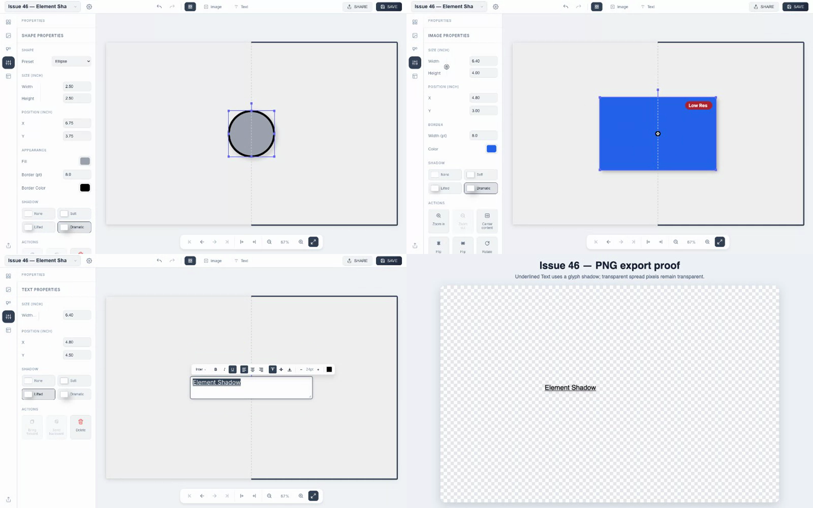

# Issue 46 — Element Shadow proof

Recorded with Google Chrome 150.0.7871.129 at a 1440 × 900 viewport.



- [Chrome proof video (MP4)](./issue-46-element-shadows.mp4)
- [Chrome proof video (WebM)](./issue-46-element-shadows.webm)
- [Transparent PNG spread export](./issue-46-element-shadows-export.png)

## Acceptance evidence

| Criteria | Evidence |
|---|---|
| Controls for Image, Shape, and Text | `element-shadows.spec.ts` exercises the accessible None, Soft, Lifted, and Dramatic buttons for each kind. |
| None defaults and preset persistence | New elements assert None; copy/removal/reload and unknown-ID round trips use the real IndexedDB-backed app. |
| Undo and redo | The Shape scenario independently undoes and redoes a preset selection. |
| Image frame silhouette | Worker-export alpha bounds prove the rectangular frame shadow; a live Fabric-canvas pixel regression verifies the Image group paints it; the Chrome proof uses transparent image content with an 8 pt border. |
| Shape silhouette and single mask | Both renderers create one shadow pass, choosing the outside border silhouette when a border exists. The proof records a filled, bordered ellipse. |
| Text glyph and underline silhouette | A transparent-PNG assertion proves the shadow follows the underlined text rather than the text box; fresh-render tests cover the non-editing Fabric object and service-worker spread thumbnail. |
| Text editing behavior | The proof changes the preset while the Tiptap overlay remains active and shows the overlay without an Element Shadow. |
| Physical size and page direction | Export alpha bounds remain within three pixels after resizing a square and rotating it 90 degrees. |
| Geometry and editor affordances | Shadows render inside each Page Element's paint path without changing its stored box, controls, snapping, or Low Res calculation. |
| Z-order, seam, and crop | Shadows paint within normal element order on the full spread surface; existing spread/page export cropping remains downstream. |
| Copy, move, replacement, and templates | The shared optional top-level field survives whole-element operations; new creation/template paths omit it. Copy retention is exercised directly. |
| Editor, thumbnails, previews, and export | Fabric uses the shared registry at 96 PPI; the worker used by thumbnails/previews/exports uses it at its target PPI. Editor and PNG output are shown in the proof. |
| Unknown identities | Unknown strings resolve to None and survive an unrelated edit plus save/reload unchanged. |

## Commands run

```sh
npm run lint
npm run build
npx playwright test
ELEMENT_SHADOW_PROOF=1 npx playwright test --config=playwright.chrome-proof.config.ts
```

Results: lint and build passed; the full Playwright suite passed with 136 tests and one intentionally skipped proof-recorder test; the explicit Chrome proof run passed.
